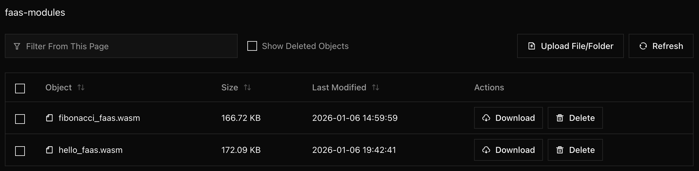
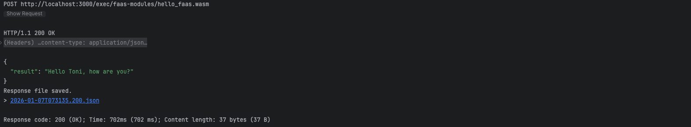
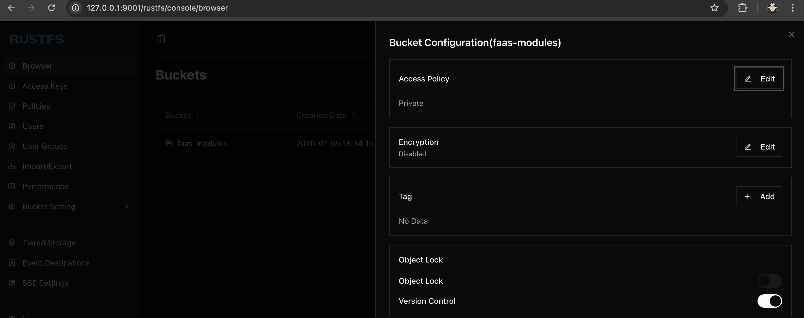
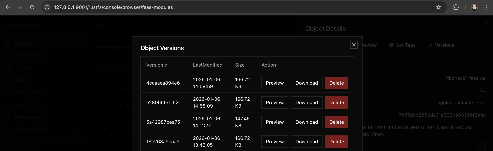

# WASM-FaaS

A Rust-based WebAssembly Function-as-a-Service platform that demonstrates secure, language-agnostic serverless computing through WASM components.
This is a simplified POC for demonstration. All executions are defined as cold start as always downloaded from RustFS (S3) and executed.

Beyond its application in API interactions, WebAssembly facilitates highly interoperable computational workflows. Through the WIT interface specification, WASM also enables the integration of exchangeable pre- and post-processing components into data-driven pipelines and execution sequences allowing for seamless component swapping.

## Architecture

**Core Components:**
- **Server**: Axum-based HTTP API with WASM runtime
- **Storage**: S3-compatible object storage (https://rustfs.com/) for WASM modules  
- **Interface**: Standardized WIT interface for function contracts
- **Runtime**: Wasmtime engine with WASI support

**Key Advantages:**
- **Language Agnostic**: Any language compiling to WASM can be deployed
- **Secure Sandboxing**: WASM provides isolated execution environment
- **Portable Functions**: Same WASM modules run anywhere
- **Hot Deployment**: Upload and execute new functions without restart
- **Resource Efficiency**: Shared runtime with isolated function instances

## WASM and SandBox

WASM files are by default in a SandBox without any access to any other resource. For this even a simple println! is not allowed, and to be included in the chain like: 

```
world faas-exec {
    import wasi:cli/stdout;
       
    export exec: func(input: string) -> string;
}
```

see https://github.com/orgs/WebAssembly/repositories?q=cli

Not all Cargo components are WASM compatible, this command can help to find components in the tree:

```shell
cargo tree -p s3-faas --target wasm32-wasip1 -i socket2
```

WASM files are lighter than Docker images in size. These examples are less than 200 KB, that have also an impact on download and improved cold start. The S3 with more dependencies 5MB.



Total time for download and execution sample < 1 sec : 



## Quick Start

### Prerequisites
```bash
# Install required tools
curl -sSf https://sh.rustup.rs | sh
cargo install wasmtime-cli
curl -LO https://github.com/bytecodealliance/wasmtime/releases/latest/download/wasi_snapshot_preview1.reactor.wasm
```

### Build & Run
```bash
# Start storage backend
docker-compose up -d

# Build server
cargo build -p server --release

# Build example functions
cargo build -p hello-faas --target wasm32-wasip1 --release
wasm-tools component new ./target/wasm32-wasip1/release/faas_exec.wasm \
  -o ./target/wasm32-wasip1/release/hello_faas.wasm \
  --adapt ./wasi_snapshot_preview1.reactor.wasm

cargo build -p fibonacci-faas --target wasm32-wasip1 --release
wasm-tools component new ./target/wasm32-wasip1/release/faas_exec.wasm \
  -o ./target/wasm32-wasip1/release/fibonacci_faas.wasm \
  --adapt ./wasi_snapshot_preview1.reactor.wasm

# Start server
./target/release/server
```

### Usage Examples
```bash
# Upload a function
curl -X POST -F "file=@./target/wasm32-wasip1/release/hello_faas.wasm" \
  http://localhost:3000/file/functions/hello

# Execute function
curl -X POST http://localhost:3000/exec/functions/hello \
  -H "Content-Type: application/json" \
  -d '{"name": "World"}'

# Response: {"result": "Hello World, how are you?"}
```

## API Endpoints

- `PUT/DELETE/GET /bucket/{bucket}` - Bucket management
- `POST/GET/DELETE /file/{bucket}/{wasmfile}` - WASM file management  
- `POST /exec/{bucket}/{wasmfile}` - Execute WASM function

## Extending the Platform

### Adding New Functions

1. **Create new WASM module** in any language:
```rust
// lib.rs
wit_bindgen::generate!({
    world: "faas-exec", 
    path: "../wit",
    generate_all,
});

struct GuestImpl;
impl Guest for GuestImpl {
    fn exec(input: String) -> String {
        // Your function logic here
        format!("Processed: {}", input)
    }
}
export!(GuestImpl);
```

2. **Build as WASM component**:
```bash
cargo build --target wasm32-wasip1 --release
wasm-tools component new target/wasm32-wasip1/release/your_module.wasm \
  -o your_function.wasm --adapt ../wasi_snapshot_preview1.reactor.wasm
```

3. **Deploy via API**:
```bash
curl -X POST -F "file=@your_function.wasm" \
  http://localhost:3000/file/functions/your_function
```

### Architecture Extensions

- **Multi-language Support**: Add Rust, Go, Python, JavaScript WASM modules
- **Database Integration**: Extend WASI with database access
- **Event Triggers**: Add webhook/event-driven execution
- **Monitoring**: Integrate metrics and logging
- **Scaling**: Add horizontal scaling with load balancer

## WIT Interface

All functions implement the standardized interface in `wit/faas.wit`:
```wit
world faas-exec {
    import wasi:cli/stdout;
    export exec: func(input: string) -> string;
}
```

This ensures consistent function signatures across all languages and enables hot-swappable function deployment.

Note: You need the `wasi_snapshot_preview1.reactor.wasm` adapter to convert the WASI preview1 module to a component.
You can download it from the [wasmtime releases](https://github.com/bytecodealliance/wasmtime/releases/latest/download/wasi_snapshot_preview1.reactor.wasm):

## Versioning

RustFS (http://127.0.0.1:9001/) contains a versioning, that could be useful to keep track and backup of your WASM files:






## SHELL

```shell
cargo build -p server --release
````

```shell
cargo build -p hello-faas --target wasm32-wasip1 --release
wasm-tools component new ./target/wasm32-wasip1/release/faas_exec.wasm -o ./target/wasm32-wasip1/release/hello_faas.wasm --adapt ./wasi_snapshot_preview1.reactor.wasm
```

```shell
cargo build -p fibonacci-faas --target wasm32-wasip1 --release
wasm-tools component new ./target/wasm32-wasip1/release/faas_exec.wasm -o ./target/wasm32-wasip1/release/fibonacci_faas.wasm --adapt ./wasi_snapshot_preview1.reactor.wasm
```

```shell
cargo build -p s3-faas --target wasm32-wasip1 --release
wasm-tools component new ./target/wasm32-wasip1/release/faas_exec.wasm -o ./target/wasm32-wasip1/release/s3_faas.wasm --adapt ./wasi_snapshot_preview1.reactor.wasm
```

## CURL

The CURL (JetBrains/HTTP) files you can find in the [curl](curl) directory

* [bucket_create.http](curl/bucket_create.http)
* [bucket_list.http](curl/bucket_list.http)
* [file_upload.http](curl/file_upload.http)
* [wasm_exec.http](curl/wasm_exec.http)